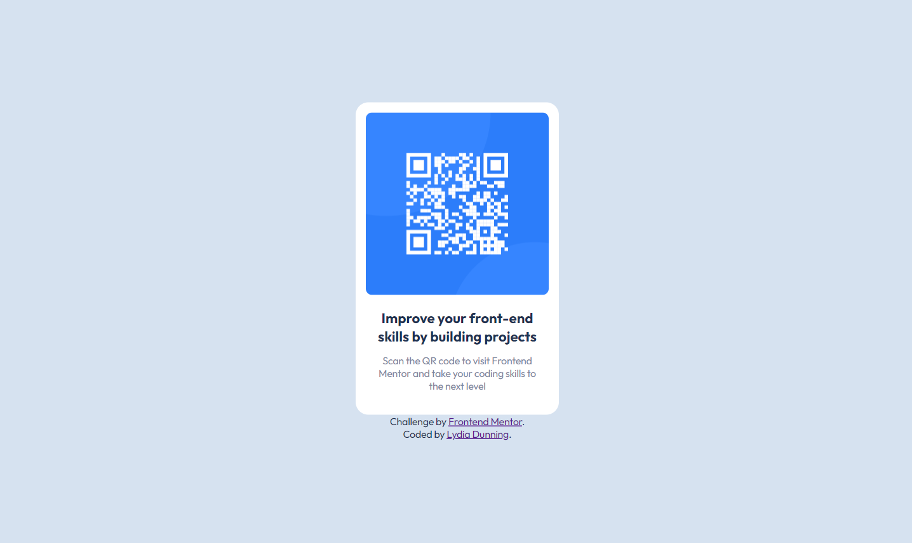

# Frontend Mentor - qr code component solution

This is a solution to the [QR code component challenge on Frontend Mentor](https://www.frontendmentor.io/challenges/qr-code-component-iux_sIO_H). Frontend Mentor challenges help you improve your coding skills by building realistic projects. 

## Table of contents

- [Overview](#overview)
  - [The challenge](#the-challenge)
  - [Screenshot](#screenshot)
  - [Take a Look](#take-a-look)
  - [Built with](#built-with)
- [Skills](#skills)
  - [Using Lit](#using-lit)
  - [Deploying a Site](#deploying-a-site)
  - [Continued development](#continued-development)
- [Author](#author)

## Overview

### The challenge

The challenge is to build out this QR code component and get it looking as close to the design as possible.

### Screenshot



### Take a Look

<!-- - Solution URL: [Add solution URL here](https://your-solution-url.com) -->
- Live Site URL: [https://lydiadunning.github.io/qr-code-component-main/](https://lydiadunning.github.io/qr-code-component-main/)

### Built with

- [Lit](https://lit.dev/) - simple library for building lightweight web components.
- [vite](https://vitejs.dev) - frontend tooling to initialize apps, serve files for development, and package builds.

## Skills

### Using Lit
#### What
Lit is a library for building web components. The qr-code and (nearly) all of its contents and styling, as well as the way it's framed by the space around it, are defined within the component.

#### Why
- I was excited to try Lit, but it required too much investment for a bigger project. 
- This project is very small.
- I switched to creating React projects in Vite, which has an option to use Lit instead.

#### How 
The sample page generated by Vite made a good starting point for what I wanted to do. I could follow the patterns I saw there. For instance, I had trouble displaying an image, so I did what they did, importing the image first,
```js
import qrCode from './assets/image-qr-code.png';
```
then adding the imported image to the QRCode element's class properties,
```js
  constructor() {
    super()
    this.qrUrl = qrCode;
    this.heading = 'Improve your front-end skills by building projects';
    this.instructions = 'Scan the QR code to visit Frontend Mentor and take your coding skills to the next level';
  }
```
and finally adding the image's name, in the property qrURL of the QRCode class, to the HTML template.
```js

```
Modifying the code into what I wanted to build served me well, it was quick and easy to get a page up, even though I don't usually use classes in Javascript.

Not everything about using Lit went so smoothly. I ran into a problem with importing a Google font, since I couldn't find a way to bring it into the element itself. Ultimately, I imported the font in the css for the index.html file which contains and displays the qr code element. This works, but it's easy to imagine a page with several elements using different fonts, and these fonts becoming frustrating to manage. On the other hand, corralling the fonts in one css file might streamline font changes, especially if css variable assignments made in the index.css persist in contained elements.

### Deploying a Site
#### What
Moving a site from the development environment to production can, in my experience, go terribly awry, even with good documentation and site with a hello-world level of complexity.
However, it can be done!

#### How 
Since this site was built with Vite, I used the command prompt npm run build to create a project build. Easy. I followed Vite's instructions to upload the site to github pages, and it was blank. The build process relies on a config file that was missing from my project, so I had to make one, and it had to contain one setting to play nice with github pages. Here's what the config file says:
```js
// vite.config.js
export default {
  // config options
  base: '/qr-code-component-main/'
}
```
Adding that tiny file was like turning a key to unlock my component.
Of course, there must be more config options which I don't know anything about. And Vite is only one option of many to create a build, and github pages is just one hosting site. However, even though many unpredictable things can go wrong in the build process, they can be overcome.

### Continued development

I named this element and many things in it a variation of 'qr code', not great. Maybe I'll make a change eventually. The element itself should retain the name, with the image becoming something like 'qrCodeImage'. 

I don't think I'll keep working with Lit, unless I have some compelling reason. I wish the class definitions were more abstract, which ultimately comes down to my preference for high level languages and building objects with factory functions. If I ever change my mind, I could use something similar to the factory pattern to create lit elements.

After uploading this to Frontend Mentor, the site displays a warning that my html should have one main landmark. This seems irrelevant to what I'm doing here, because I'm using index.html like a plate to serve my element on, and the qr-card would fall within a landmark like main, header, or nav if it was part of a site. 
I would agree that this element wouldn't be accessible, and a quick search didn't turn up much about practical methods for increasing the accessibility of Lit elements.

## Author

- Website - [Lydia Dunning](https://lydiadunning.github.io/Portfolio/)
- Frontend Mentor - [@lydiadunning](https://www.frontendmentor.io/profile/lydiadunning)

